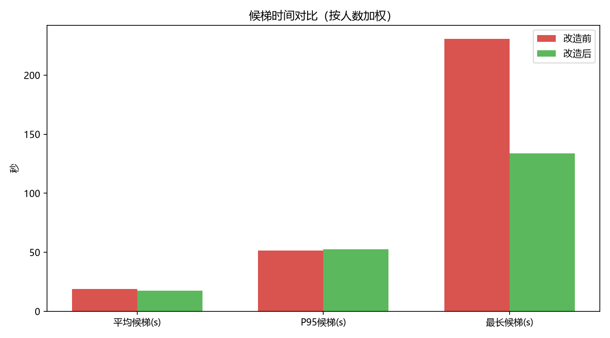
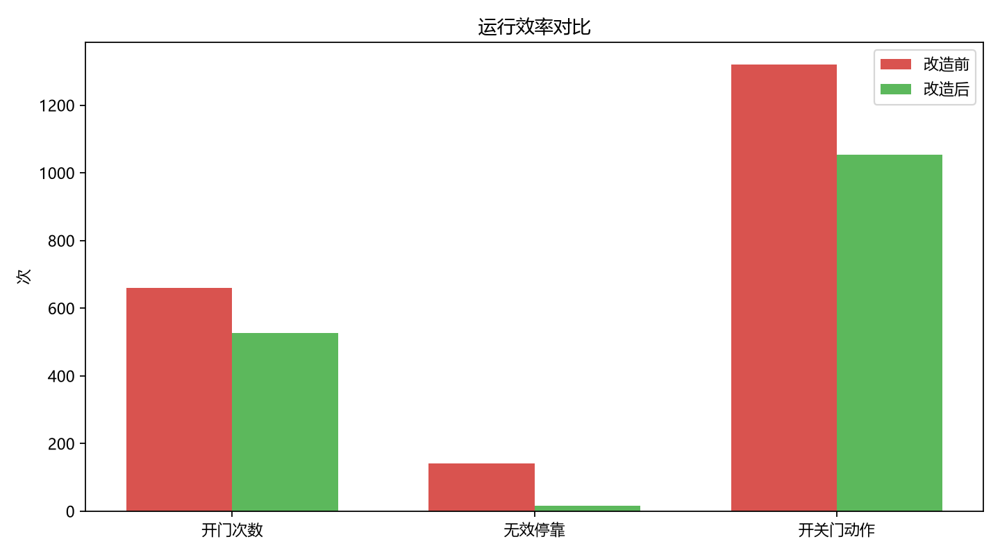
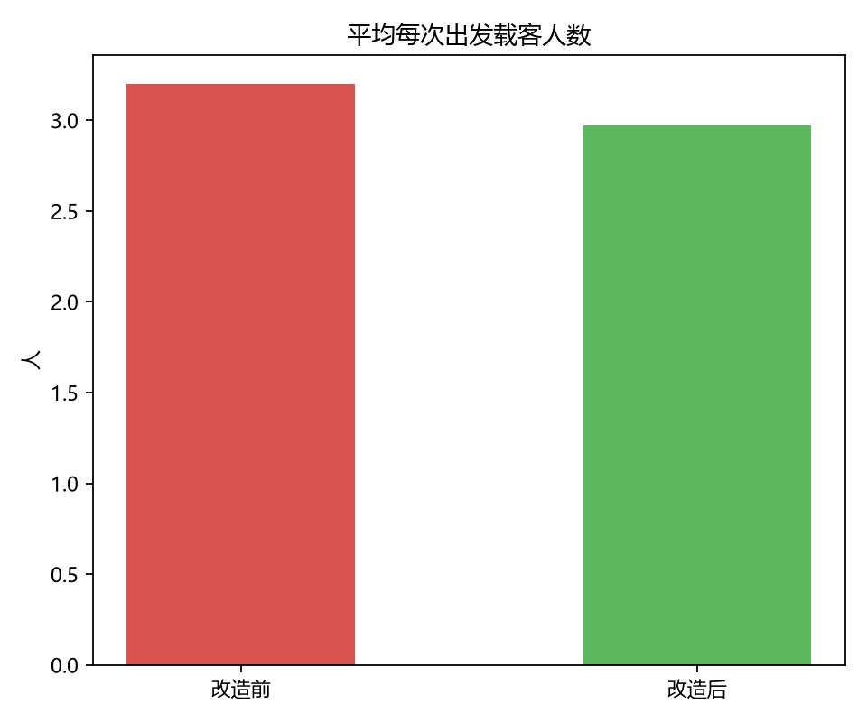

# 红豆斋宿舍楼电梯群控调度仿真系统

> 基于仿真的电梯调度优化系统 —— 面向校园宿舍楼学生集中乘梯场景的运行仿真与改造效果评估。
>
> 场景原型：**红豆斋**宿舍楼（地上 15 层，3 台电梯）。

---

## 一、项目简介

本项目面向校园宿舍楼学生集中使用电梯的场景，建立电梯运行与学生乘梯过程的仿真模型。

通过模拟学生乘梯需求和电梯运行过程，对比改造前后的调度方式，量化评估各项改造措施的实际效果。

项目主要关注以下指标：

- 学生候梯时间（平均 / P95 / 最长）
- 学生乘梯时间
- 电梯开门、关门次数
- 无效停靠次数
- 电梯载客情况
- 电梯利用率

---

## 二、项目背景

### 2.1 真实场景：红豆斋

| 项目 | 情况 |
|---|---|
| 地上楼层 | 15 层 |
| 电梯 | 3 台（1 号服务单数层，2 号服务双数层，3 号服务全部楼层） |
| 额定载客 | 10～11 人 |
| 主要问题 | 高峰期候梯时间长、多个呼梯按钮并联触发效率低、空开门、满载后调度策略僵化 |

### 2.2 学生行为设定

| 人群 | 楼层 | 人数 | 行为 |
|---|---|---|---|
| 学长 | 2～8 层 | 每层 20 人 | 只下楼，目标 1 层；全时段均匀分布；互不相干 |
| 学弟 | 9～15 层 | 每层 80 人 | 只上楼，目标自己宿舍楼层；集中在高峰 1 小时；2～5 人结伴 |

- 学长下行：全时段均匀分布（含 3 小时普通时段 + 1 小时高峰时段）
- 学弟上行：高峰时段均匀分布
- 学生刷闸机后 **5 秒内**可以按下电梯按钮（改造前）

---

## 三、改造方案

| # | 改造措施 | 对应现实痛点 |
|---|---|---|
| ① | **三键合一**：一个按钮统一派梯，只派最合适的一台 | 按下多个呼梯按钮仍然低效 |
| ② | **毫米波人体存在传感器**：这一层没人上下就直接跳过，不空开门 | 空开门、无效空跑 |
| ③ | **空闲梯预调度**：预判高峰期，提前把闲梯放到 1 楼待命 | 高峰期等候时间长 |
| ④ | **刷脸呼梯**：刷脸即呼梯，不用再走过去按按钮 | 总要伸手按按钮，按键老化失灵 |

此外，调度内核上还有一项配套机制：**每 30 秒重新评估一次尚未上车的呼梯请求，必要时改派更合适的电梯**，
对应"满载后调度策略僵化"这个痛点。

---

## 四、仿真模型

### 4.1 主要参数

| 参数 | 设置 |
|---|---:|
| 楼层数 | 15 |
| 电梯数量 | 3 台 |
| 仿真时长 | 普通时段 3 h + 高峰时段 1 h（结束后再跑 20 min 清空队列） |
| 仿真学生人数 | 700 人 |
| 相邻楼层高度 | 3.5 m |
| 开门 / 关门时间 | 2.6 s / 2.6 s |
| 最大运行速度 | 1.75 m/s |
| 启动最大加速度 | 0.6 m/s² |
| 额定载客 | 11 人 |
| 调度算法 | LOOK（同向优先，跑完一个方向再折返） |
| 时间步长 | 0.2 s |

> **关于"时间步长"**：仿真并不是连续推进的，而是把时间切成一小格一小格来算，
> 每一格 **0.2 秒**。所有动作（开门、关门、加速、减速）都记录在这一格的时间点上，
> 也就是说仿真时间的**分辨率是 0.2 秒**——两次事件如果间隔小于 0.2 秒，就会被当作同一时刻处理。
> 取 0.2 秒是因为：再调细（如 0.05 s）结果几乎不变，只是跑得更慢；
> 调粗（如 1 s）则会明显低估停站与加减速的耗时。它是精度和速度之间的折中。

### 4.2 电梯运行模型

电梯根据运行距离采用不同的运动模式：

- **较长距离运行：**匀加速 → 匀速 → 匀减速（梯形速度曲线）
- **较短距离运行：**匀加速 → 匀减速（三角形速度曲线，加速不到最大速度）

### 4.3 什么叫"无效停靠"

电梯在某一层停住了，但**既没有人下、也没有人上**——这就是一次无效停靠。最常见的两种情况：

1. **空跑白停**：这一层原来有人呼梯，等电梯到了，人已经被别的电梯接走（或已自行离开）；
2. **满载白停**：车已经满员，到站开门也一个人都上不来。

需要说明的是：这个指标统计的是**"白停"这个动作本身**，与门有没有打开无关。
改造前每次白停都要开关一次门（纯浪费）；改造后毫米波传感器会把其中大部分白停直接跳过、不开门，
所以改造后剩下的少量无效停靠**不再产生开关门的时间损失**——看"开门次数"和"无效停靠"两列对比即可看出区别。

---

## 五、评价指标

| 指标 | 含义 |
|---|---|
| 平均候梯时间（按键起算） | 从按下按钮到上车 |
| 平均候梯时间（闸机起算） | 从刷闸机到上车，**两列之差就是找按钮、按按钮花掉的时间** |
| P95 候梯时间 | 95% 的学生候梯时间不超过该值 |
| 最大候梯时间 | 极端情况下最长的一次等待 |
| 平均乘梯时间 | 上车到到达目标楼层 |
| 无效停靠次数 | 空开门的次数，衡量电梯做了多少无用功 |
| 平均每次出发载客人数 | 反映顺路拼车的程度 |
| 电梯运行利用率 | 运行时间占比 |

---

## 六、运行方法

### 6.1 环境要求

- Windows 10 / Windows 11
- Python 3.x（仅使用标准库，画图才需要 `matplotlib`）

### 6.2 运行

```bash
python elevator_simulation.py            # 跑 1 个随机种子
python elevator_simulation.py 20         # 跑 20 个随机种子，报均值 ± 波动范围
python elevator_simulation.py 20 1.0     # 第 3 个参数：每人上下车耗时（秒）
python elevator_simulation.py 20 ablate  # 跑"分步拆解"实验
```

### 6.3 输出

- 控制台：改造前后各项指标、分步拆解表
- `simulation_results.csv`：结果数据
- `waiting_time_comparison.png` / `operation_comparison.png` / `load_comparison.png`（装了 matplotlib 才有）

---

## 七、实验结果（20 个随机种子的平均）

> 改造前后两次模拟使用**同一批学生、同一批客流**（相同随机种子），只有调度方式不同。
> 括号里是 20 次实验中最低 ~ 最高的波动范围。
>
> **本章三张表的数字不能直接横向比对，它们是三次不同设定的实验**：
> 7.1 / 7.3 是 20 个种子的"改造前 vs 改造后"对比；7.2 是同一批种子的分步拆解，
> 中间几行代表"改造只做了一部分"的中间状态；7.4 把每人上下车耗时设为 1 秒、重跑 10 个种子。
> 因此"无效停靠"一列会出现 142、24、17、16、140.5、17.2 等不同数字——它们对应的是不同实验条件，
> 而不是同一组实验里前后矛盾。此外，表中出现的 17.2、140.5 这类小数是**多次实验的平均值**，
> 单次实验的无效停靠次数一定是整数。

### 7.1 改造前后对比

| 指标 | 改造前 | 改造后 | 变化 |
|---|---:|---:|---:|
| 完成率 | 100.00% | 100.00% | — |
| 平均候梯（按键起算） | 19.03 s (16.85 ~ 22.46) | 17.62 s (13.89 ~ 22.51) | **−7.5%** |
| 平均候梯（闸机起算） | 23.03 s (20.85 ~ 26.46) | 17.62 s (13.89 ~ 22.51) | **−23.5%** |
| P95 候梯 | 51.45 s | 52.57 s | +2.2%（略差） |
| 最大候梯 | 230.73 s (83 ~ 488) | 133.59 s (66 ~ 238) | **−42.1%** |
| 平峰平均候梯 | 8.23 s | 12.11 s | +47%（变差，原因见 7.3） |
| 高峰平均候梯 | 20.98 s | 18.60 s | **−11.3%** |
| 高峰最长候梯 | 230.73 s | 133.59 s | **−42.1%** |
| 平均乘梯时间 | 31.37 s | 29.70 s | −5.3% |
| 开门次数 | 660 (636 ~ 674) | 527 (508 ~ 545) | **−20.1%** |
| 开关门动作总数 | 1319 | 1054 | **−20.1%** |
| 无效停靠次数 | 142 (129 ~ 153) | 16 (7 ~ 26) | **−88.6%** |
| 平均每次出发载客 | 3.20 人 | 2.97 人 | −7.2% |
| 电梯运行利用率 | 21.49% | 21.09% | −1.9% |







### 7.2 分步拆解：每项措施各自的贡献

把改造措施一项一项启用，观察每一步的边际效果：

| 阶段 | 候梯(按键) | 候梯(闸机) | P95 | 最长 | 高峰平均 | 开门次数 | 无效停靠 |
|---|---:|---:|---:|---:|---:|---:|---:|
| 改造前（三键齐按） | 19.0 s | 23.0 s | 51.5 s | 230.7 s | 21.0 s | 660 | 142 |
| ① 三键合一统一派梯 | 27.5 s | 31.5 s | 70.6 s | 190.0 s | 30.3 s | 519 | 24 |
| ② ＋毫米波传感器 | 26.3 s | 30.3 s | 67.5 s | 168.6 s | 28.9 s | 498 | 24 |
| ③ ＋空闲梯预调度 | **17.5 s** | 21.5 s | 53.1 s | 141.9 s | **18.5 s** | 525 | 17 |
| ④ ＋刷脸免按键 | 17.6 s | **17.6 s** | 52.6 s | **133.6 s** | 18.6 s | 527 | **16** |

**三个主要结论：**

1. **单独实施"三键合一"会使候梯时间上升（19.0 → 27.5 s）**。
   改造前多个按钮并联触发，相当于两台电梯同时响应；改为单梯派梯后，单次响应自然变慢。
2. **真正压低候梯时间的是"空闲梯预调度"（26.3 → 17.5 s）**。
   高峰期所有学生在 1 楼聚集，提前将空闲电梯调度至 1 楼待命，比任何派梯算法都更有效。
3. **刷脸免按键省下的不是"电梯时间"，是学生本人的 5 秒**。
   按键起算的候梯时间几乎不变（17.5 → 17.6 s），但从刷闸机起算直接减少 3.9 秒（21.5 → 17.6 s）。

### 7.3 一个反直觉的发现

**"三个按钮都按"是一种个体最优、整体受损的策略：人少时个人确实更快，人多时拖慢整栋楼。**

| | 改造前（三键齐按） | 改造后（统一派梯） |
|---|---:|---:|
| 平峰平均候梯 | **8.23 s**（更快） | 12.11 s |
| 高峰平均候梯 | 20.98 s | **18.60 s**（更快） |
| 无效停靠 | 142 次 | **16 次** |

平峰时人少，两台电梯同时响应，个人确实更快；代价是多跑空车、多开空门。
高峰期运力紧张，这些空跑空门挤占运力，全楼一起变慢。

> 因此本项目的结论不是"让电梯跑得更快"，而是**"让电梯不再做无用功"**。

### 7.4 敏感性分析：计入上下客耗时

默认模型不计乘客上下车耗时（开关门 2.6 s 后直接运行）。
将每人上下车耗时设为 1 秒再跑一遍（10 个种子）：

| 指标 | 改造前 | 改造后 | 变化 |
|---|---:|---:|---:|
| 平均候梯 | 25.64 s | 24.98 s | −2.6% |
| 最大候梯 | 354.24 s | 220.17 s | −37.8% |
| 开门次数 | 644.8 | 507.8 | −21.2% |
| 无效停靠 | 140.5 | 17.2 | −87.8% |

**结论对"上下客耗时"这一假设不敏感**：改造后减少的 20% 开门、88% 无效停靠，量级基本不变。

---

## 八、模型的边界与假设

为保证结论严谨，明确本模型的适用范围：

1. **候梯时间的两种算法不能混用**。本项目主要报"按键起算"，因为它不含走路找按钮的时间，
   更能反映电梯本身的性能。想看用户真实感受请看"闸机起算"那一栏。
2. **上下客耗时默认设为 0**（`T_PAX = 0.0`）。这是低估拥堵的，7.4 节给出了设为 1.0 的结果。
3. **未建模"学弟推荐乘梯至相邻楼层后步行"和"低功耗模式"** 这两项措施，本仿真未体现其收益。
4. **电梯分区服务（单/双/全层）在改造前后都存在**，它是红豆斋的现状，不是本项目的改造内容。
5. **学生到达按均匀分布抽样**，真实客流有更强的阵发性（如打铃瞬间），本模型会低估瞬时拥堵。
6. **未建模电梯故障、检修、异物阻挡关门等现实扰动。**
7. 所有数字都是**本模型**的结果，不是对现实电梯运行的预测。

---

## 九、后续优化

- [ ] 空闲梯分区待命（解决"平峰反而变慢"）
- [ ] 建模"推荐乘梯至相邻楼层后步行"
- [ ] 网页动画演示：15 层井道 + 3 台轿厢，改造前后左右对比
- [ ] 真实客流阵发性建模（打铃时刻的瞬时冲击）
- [ ] 加入电梯故障、检修、异物阻挡等扰动

---

## 十、项目结构

```text
Smart-Elevator-Simulation/
├── README.md
├── elevator_simulation.py            # 主程序：改造前后对比仿真
├── simulation_results.csv            # 仿真结果数据
├── waiting_time_comparison.png       # 候梯时间对比图
├── operation_comparison.png          # 运行效率对比图
├── load_comparison.png               # 平均载客对比图
├── .gitignore
└── LICENSE
```

---

## 十一、作者

**姓名：** 余炜煜

**项目名称：** 红豆斋宿舍楼电梯群控调度仿真系统

**开发语言：** Python（仅使用标准库）

---

## 十二、开源许可

本项目采用 [MIT License](LICENSE)。
